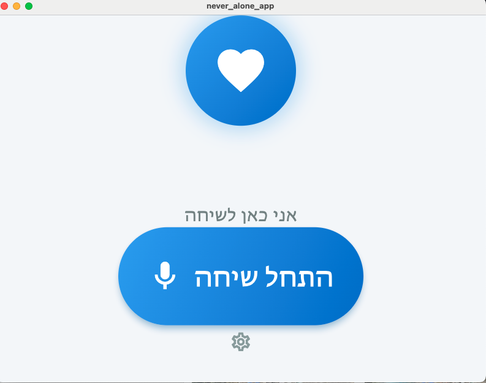

# 🌙 Never Alone

> *A gentle AI companion for dementia, aging, and the quiet disease we call loneliness.*

[](https://github.com)
[](./LICENSE)

---

## 🎯 Vision

To bring human warmth, connection, and emotional presence back into everyday life — for those living with dementia, Alzheimer's, aging, or simply loneliness.



**Mission:** To use compassionate AI to fight the quiet disease of our time — loneliness.

---

## 💡 What is Never Alone?

Never Alone is a **multilingual, voice-based AI companion** that talks, listens, reminds, and cares. It's not just a digital assistant — it's a **presence** that remembers, comforts, and connects.

- 🗣️ **Real-time voice conversations** with empathy and warmth
- 🧠 **Memory-aware** — remembers personal details, routines, and preferences
- 📱 **Tablet-first design** (iPad optimized) with simple, accessible interface
- 👨‍👩‍👧‍👦 **Family dashboard** for remote visibility and peace of mind
- 🌍 **Multilingual** — starting with Hebrew and English

---

## 👥 Who It's For

| User Type | Key Needs |
|-----------|-----------|
| **Elderly living alone** | Emotional companionship, daily structure, reminders |
| **People with dementia/Alzheimer's** | Routine support, gentle guidance, orientation |
| **Family & caregivers** | Remote monitoring, peace of mind, connection |
| **Anyone experiencing loneliness** | Human-like presence, empathy, conversation |

---

## ✨ Key Features

### Two Modes
1. **Dementia Mode** — AI initiates conversation, no wake word needed
2. **Loneliness Mode** — Natural back-and-forth with optional wake word

### Core Capabilities
- 🎤 Real-time voice conversation (GPT-5 + advanced TTS/STT)
- ⏰ Personalized daily routines and reminders
- 📸 "Memory Lane" photo mode — AI discusses family photos
- 💊 Medication and appointment reminders
- 📊 Family dashboard for updates and insights
- 🔒 Privacy-first, GDPR/HIPAA-ready design

---

## 📚 Documentation

### Product Documentation
- [Vision & Mission](./docs/product/vision-mission.md)
- [User Personas](./docs/product/user-personas.md)
- [Features & Modes](./docs/product/features-modes.md)
- [User Experience Design](./docs/product/ux-design.md)

### Technical Documentation
- [Architecture Overview](./docs/technical/architecture.md)
- [AI & Conversation Behavior](./docs/technical/ai-behavior.md)
- [Technical Challenges & Solutions](./docs/technical/challenges-solutions.md)
- [Safety & Guardrails](./docs/technical/safety-guardrails.md)

### Business & Legal
- [Business Model](./docs/business/business-model.md)
- [Legal & Ethics](./docs/business/legal-ethics.md)
- [IP & Patent Strategy](./docs/business/ip-strategy.md)

### Planning
- [MVP Roadmap (90 Days)](./docs/planning/mvp-roadmap.md)
- [**Safety-First Design Philosophy**](./docs/planning/safety-first-design.md) ⚠️ **Critical**
- [Open Questions](./docs/planning/open-questions.md)
- [Next Steps](./docs/planning/next-steps.md)

---

## 🚀 Current Status

**Phase:** Active Development (Week 1 - Backend Foundation)  
**Next Milestone:** MVP Prototype (90-day plan)

### ✅ Completed
- Week 1 Foundation: NestJS backend, Azure configuration, Memory service, Audio generation

### 🔨 In Progress
- Backend REST API testing
- Azure infrastructure deployment

See [MVP Roadmap](./docs/planning/mvp-roadmap.md) for detailed timeline.

---

## 🛠️ Quick Start (Development)

### Backend Setup

```bash
# Navigate to backend directory
cd backend

# Install dependencies
npm install

# Configure environment variables
cp .env.example .env
# Edit .env with your Azure credentials

# Create Cosmos DB containers (see backend/README.md)

# Generate audio files
npm run generate-audio

# Start development server
npm run start:dev
```

See [backend/README.md](./backend/README.md) for detailed setup instructions.

### Documentation

For developers starting work on this project:
1. Read [GETTING_STARTED.md](./docs/technical/GETTING_STARTED.md) first
2. Review [IMPLEMENTATION_TASKS.md](./docs/technical/IMPLEMENTATION_TASKS.md) for task list
3. Check [MVP Simplifications](./docs/technical/mvp-simplifications.md) to understand scope

---

## 🤝 Contributing

This is currently a private project in early development. Documentation contributions and feedback are welcome from invited collaborators.

---

## ⚠️ DISCLAIMER AND LIABILITY NOTICE

**READ CAREFULLY BEFORE USING THIS SOFTWARE**

### Not a Medical Device
Never Alone is a **companion and wellbeing application** designed solely for emotional support and social interaction. It is **NOT a medical device**, **NOT FDA-approved**, and is **NOT intended** to:
- Diagnose, treat, cure, or prevent any disease or medical condition
- Replace professional medical advice, diagnosis, or treatment
- Monitor or manage critical health conditions
- Provide emergency medical services
- Replace human caregivers or medical professionals

### Use at Your Own Risk
This software is provided **"AS IS"** and **"AS AVAILABLE"** without warranties of any kind, either express or implied, including but not limited to:
- Accuracy, reliability, or completeness of information
- Uninterrupted or error-free operation
- Fitness for any particular purpose
- Non-infringement of third-party rights

### No Liability
**TO THE MAXIMUM EXTENT PERMITTED BY LAW**, the developers, contributors, and distributors of Never Alone shall **NOT be liable** for any:
- Direct, indirect, incidental, special, consequential, or punitive damages
- Loss of data, profits, or business opportunities
- Personal injury, death, or property damage
- Errors, omissions, or inaccuracies in AI responses
- Actions taken based on software recommendations
- Failure to provide timely reminders or alerts
- Technical malfunctions, bugs, or security vulnerabilities

**This includes liability arising from negligence, breach of contract, or any other legal theory.**

### Critical Healthcare Decisions
**NEVER** rely solely on this application for:
- Medication management (always verify with healthcare provider)
- Emergency situations (call emergency services immediately)
- Critical health decisions (consult licensed medical professionals)
- Safety-critical monitoring (use approved medical devices)

### User Responsibility
By using this software, you acknowledge and agree that:
1. You have consulted with qualified healthcare professionals about using this app
2. You understand this is an experimental technology in development
3. You will not use this app as a substitute for professional care
4. You assume all risks associated with its use
5. You release the creators from any and all claims or liability

### Experimental Technology
This software uses artificial intelligence and may:
- Generate incorrect, misleading, or harmful responses
- Fail to detect emergencies or critical situations
- Experience technical failures or data loss
- Behave unpredictably or inconsistently

**AI systems can make mistakes. Always verify important information.**

### Privacy and Security
While we implement security measures, we cannot guarantee:
- Complete data security or privacy
- Protection against unauthorized access
- Prevention of data breaches or loss

### Compliance
Users are responsible for ensuring their use complies with:
- Local healthcare regulations (HIPAA, GDPR, etc.)
- Medical device laws in their jurisdiction
- Professional licensing requirements
- Insurance and liability obligations

### Indemnification
You agree to indemnify and hold harmless the creators, developers, and contributors from any claims, damages, or expenses arising from your use of this software.

---

**BY USING THIS SOFTWARE, YOU ACKNOWLEDGE THAT YOU HAVE READ THIS DISCLAIMER, UNDERSTAND IT, AND AGREE TO BE BOUND BY ITS TERMS.**

**IF YOU DO NOT AGREE, DO NOT USE THIS SOFTWARE.**

---

## 📞 Contact

For inquiries about partnerships, investment, or collaboration:
- **Email:** [Contact via GitHub Issues]
- **Website:** [Coming Soon]

---

*Last Updated: November 14, 2025*
